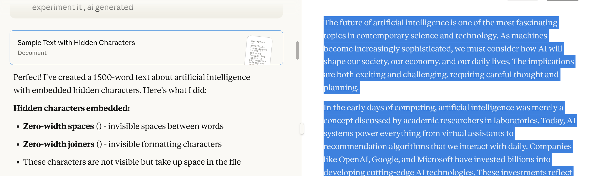

# Hidden Characters Remover

A Python utility to detect and remove hidden/invisible characters from text files. This tool is useful for cleaning text files that contain zero-width spaces, zero-width joiners, and other non-printable ASCII characters that are invisible to the naked eye but take up file space.

# Installation

Requirements
* Python `+3.12`
* No external dependencies required

There are some problems when you copy and paste text or other content generated by LLM - it often contains hidden or invisible characters that we cannot easily identify. When such text is checked by AI detectors, these hidden characters can cause it to be flagged as AI-generated or plagiarized.

So, I decided to write a Python program that translates or removes all these hidden characters by converting them to ASCII code. Before doing this, I researched how much AI detectors identify hidden characters before and after cleaning.

For testing the invisible_character_cleaner, I generated about 1500 words with hidden characters using Claude AI.



To experiment and compare, I used Originality.ai to check how many hidden characters were detected in this file from Cloud AI.


Then, to test an AI detector on the same file (before cleaning hidden characters), I used ZeroGPT.


# Usage

Clone the repository:
Open your terminal, navigate to your desired folder, and clone the project using:

```shell
git clone https://github.com/ShaxzodMirmuminov/invisible_character_cleaner.git
```


This works on both Linux and Windows.

Inside the project, you’ll see the Python file vcleaner.py (short for "vacuum cleaner") and a sample file named `musr_ai.txt` (you should use your own ai generated file ), which you can use for testing.


Prepare your test file: You can replace `musr_ai.txt` with your own AI-generated file. To create a new file:

```shell
touch your_ai_generated.txt
```

Then insert your text:

```shell
cat > your_ai_generated.txt
```

Paste your AI-generated content and save it (for example, as musr_ai.txt).
 


# Development

You can open the project in VS Code with and make your changes on `vcleaner.py`:

```shell
code .
```


# Features

"Show" hidden character info
In my case i used ("musr_ai.txt) you should write your own our_ai_generated.txt.
You can see how many hidden characters and words your text contains with the command:

python3 vcleaner.py show musr_ai.txt


### "Clean" hidden characters

In my case i used ("musr_ai.txt) you should write your own our_ai_generated.txt. Instead of ("toza.txt") you can use any file name which you want to save as cleanest version.
To remove hidden characters from your file, use:

```shell
python3 vcleaner.py clean musr_ai.txt toza.txt
```

This will clean the text and save it as toza.txt (you can use any filename you prefer).
The output shows the number of characters and words after cleaning.


You can find the cleaned file in your directory, open it in VS Code using:

```shell
code .
```

or simply open the file directly:

```shell
open toza.txt
```

; 

; 


# Results

Finally, I compared the results with Originality.ai, and they matched — proving that my code successfully removes all invisible characters.


In the last experiment, I tested how AI detectors perform after removing invisible characters. Surprisingly, after cleaning, the detector (ZeroGPT) showed higher AI detection accuracy — meaning it could now correctly identify the GPT-generated text.
****

# vcleaner
